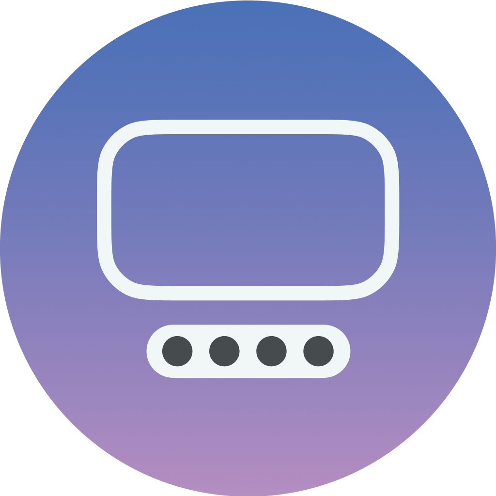
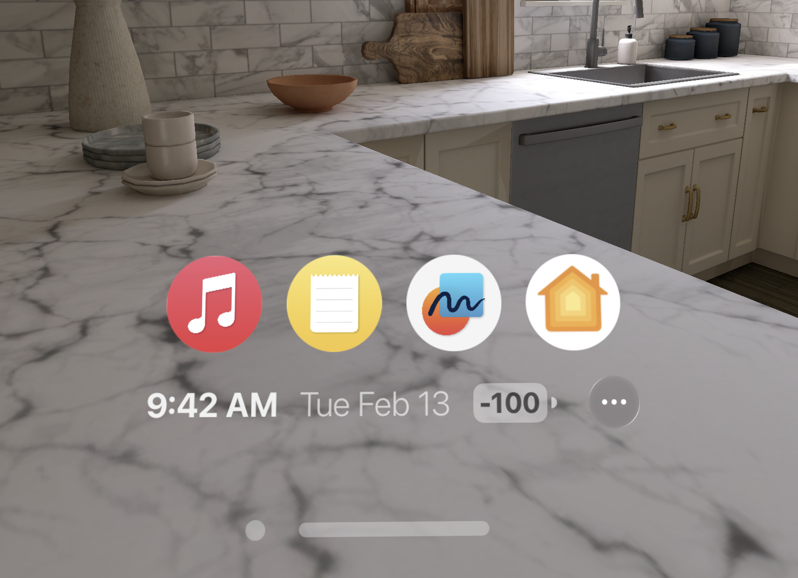

 

  

  <h3 align="center">SpatialDock+</h3>

  

    A dock for visionOS + a few extras.
     
     
  

     

## About The Project

A customizable floating dock you can place anywhere, no longer do not have to awkwardly reach the Digital Crown to launch your most used apps.

<b>Why isn't this on the App Store:</b> Due to section <a href="https://developer.apple.com/app-store/review/guidelines/#:~:text=2.5.8%20Apps%20that%20create%20alternate%20desktop/home%20screen%20environments%20or%20simulate%20multi%2Dapp%20widget%20experiences%20will%20be%20rejected." target="_blank">2.5.8</a> of the Apple App Store guidelines, this concept was <a href="https://x.com/paytondev/status/1757099991309410593?s=20" target="_blank">rejected</a>.

## Getting Started

You will need the latest version of Xcode to deploy this app to your Apple Vision Pro. 

### Prerequisites

* Xcode
* Provisional license for app deployment
* Apple Vision Pro

### Installation

1. Download the latest release of SpatialDock+
2. Open in Xcode and navigate to "Signing & Capabilities" - Update the "Team" and "Provisioning Profile" to your active developer information.
3. Choose your Apple Vision Pro as the Run destination. If you need help setting up your AVP to Xcode, follow the instructions on Apple's Developer site.
4. Run! 🎉

## Authors

* **exDeveloper** - [exDeveloper](https://twitter.com/iOS_App_Dev)
* **paytondev** - [paytondev](https://twitter.com/paytondev)
* **JonLebron** - *+ Modifications* - [JonLebron](https://twitter.com/itsjonlebron)

